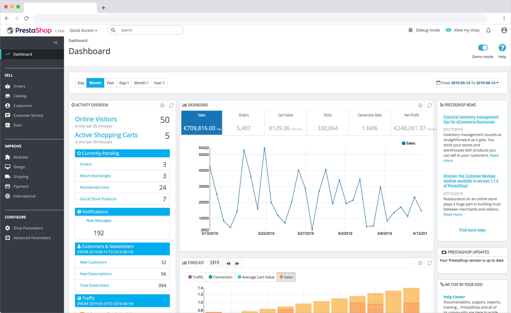

<!--
NB: Deze README is automatisch gegenereerd door <https://github.com/YunoHost/apps/tree/master/tools/readme_generator>
Hij mag NIET handmatig aangepast worden.
-->

# Prestashop voor Yunohost

[](https://ci-apps.yunohost.org/ci/apps/prestashop/)  

[](https://install-app.yunohost.org/?app=prestashop)

*[Deze README in een andere taal lezen.](./ALL_README.md)*

> *Met dit pakket kun je Prestashop snel en eenvoudig op een YunoHost-server installeren.*  
> *Als je nog geen YunoHost hebt, lees dan [de installatiehandleiding](https://yunohost.org/install), om te zien hoe je 'm installeert.*

## Overzicht

PrestaShop is an Open Source e-commerce web application, committed to providing the best shopping cart experience for both merchants and customers. It is written in PHP, is highly customizable, supports all the major payment services, is translated in many languages and localized for many countries, has a fully responsive design (both front and back office), etc.

**Geleverde versie:** 8.2.0~ynh1

**Demo:** <https://demo.prestashop.com/#/en/front>

## Schermafdrukken



## Documentatie en bronnen

- Officiele website van de app: <https://prestashop.com>
- Officiele gebruikersdocumentatie: <https://doc.prestashop.com/display/PS17/Guide+de+l'utilisateur>
- Upstream app codedepot: <https://github.com/PrestaShop/PrestaShop>
- YunoHost-store: <https://apps.yunohost.org/app/prestashop>
- Meld een bug: <https://github.com/YunoHost-Apps/prestashop_ynh/issues>

## Ontwikkelaarsinformatie

Stuur je pull request alsjeblieft naar de [`testing`-branch](https://github.com/YunoHost-Apps/prestashop_ynh/tree/testing).

Om de `testing`-branch uit te proberen, ga als volgt te werk:

```bash
sudo yunohost app install https://github.com/YunoHost-Apps/prestashop_ynh/tree/testing --debug
of
sudo yunohost app upgrade prestashop -u https://github.com/YunoHost-Apps/prestashop_ynh/tree/testing --debug
```

**Verdere informatie over app-packaging:** <https://yunohost.org/packaging_apps>
